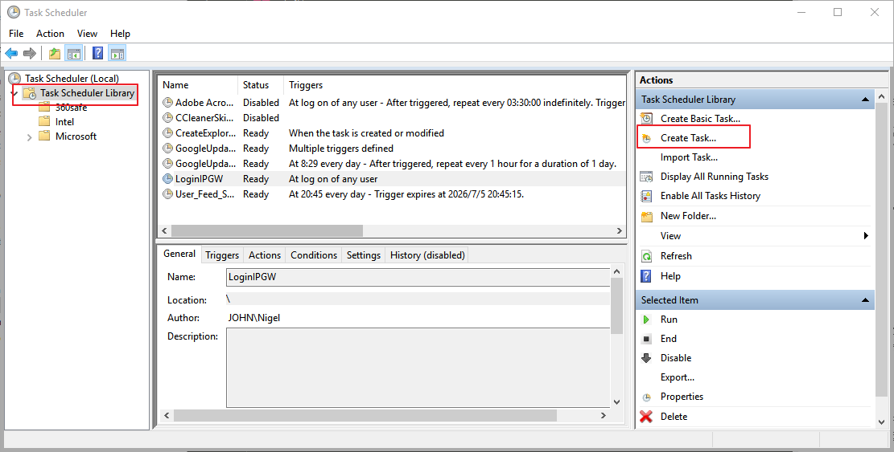

# 自动登陆/退出 IP网关

## 安装
- 本脚本需要`Python3`运行环境

  > 请搜索Python官网，在Download页面选择下载Python3.5的Windows版本的安装包
  > 下载完成后双击安装即可
  
- 在本地新建文件夹，将本目录中的三个文件下载到文件夹中  

## 配置

- 用文本编辑器打开`login.bat`, 将`<your-username>`和`<your-password>`部分替换为你自己的校园网账号和密码

  > 本脚本只是代为登陆，不会上传或保存你的密码

- 同上，将`logout.bat`中的`<your-password>`部分替换
- 使用`Win+R`打开运行，输入`gpedit.msc`回车，打开本地组策略管理。
  
- 展开`电脑配置->Windows设置->脚本(启动/关机)`，在右侧的`启动`中右键，选择`属性`，然后弹出对话框右侧的`添加`，在`脚本名`右侧点击`浏览`，找到你下载的`login.bat`脚本，选中。
- 同理设置`关机`脚本，这里要选择`logout.bat`文件

## 说明
太累了，不想说了...
